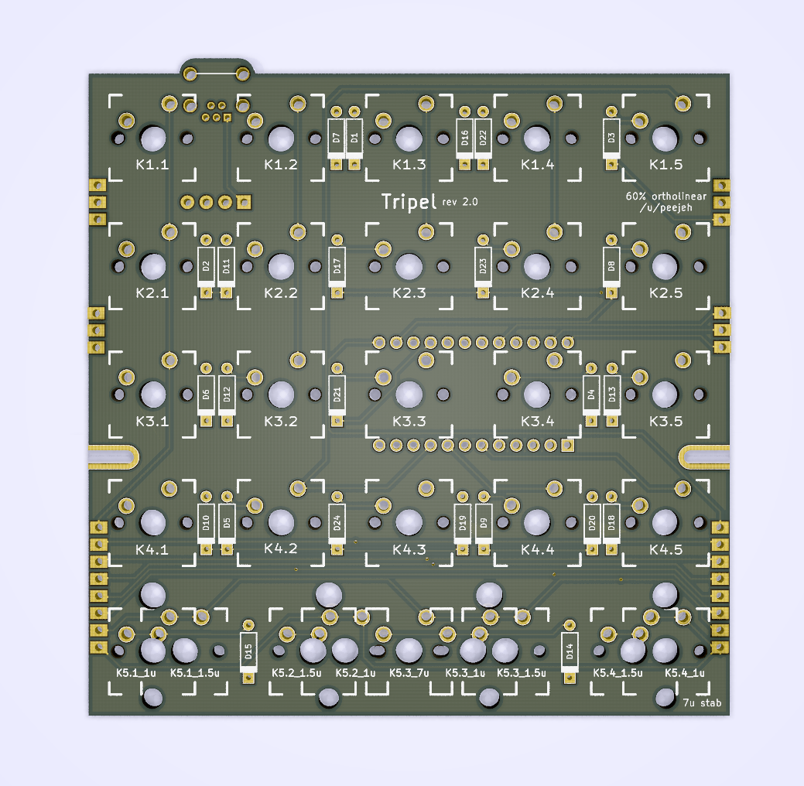
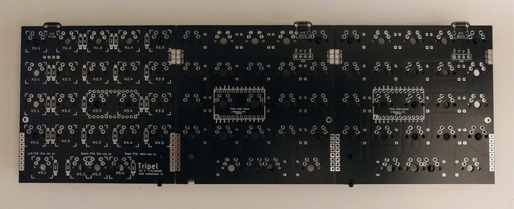
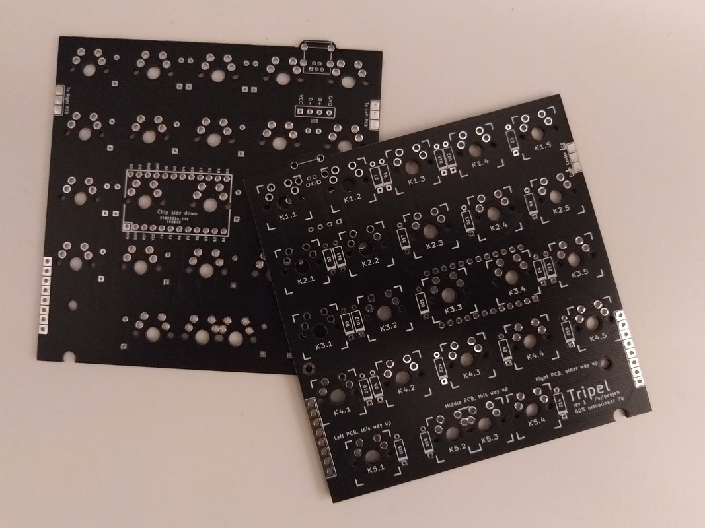

Tripel is a 15x4+1x5 key ortholinear keyboard PCB.

The goal of this project is to build a pro-micro powered ortholinear PCB that fits in a standard 60%   tray mount case but built from sub-100x100mm PCB boards.

* Designed to be easy to build with minimal soldering experience.
* Built from 3 of the same PCB.
* 7u spacebar bottom row.

# Bill of Materials (BOM)

* 3 PCBs.
* 65 MX compatible switches.
* 65 1n4148 diodes.
* Pro Micro controller (or compatible alternative).
* Through-hole USB mini or micro connector.
* USB cable for Pro Micro.

# Ordering PCBs

PCBs can be manufactuered by a variety of online PCB fabricators. You can use [PCBShopper](https://pcbshopper.com/) to search for the best price.

The zip file in the gerber directory contains the gerber files your fabricator will need to make the PCB [tripel.zip](https://github.com/peej/tripel-keyboard/blob/master/gerber/tripel.zip) PCB.

When uploading the gerber zip files, use the default PCB settings.

# Construction

* You will need 3 PCBs.
* Solder the diodes onto the underside of each PCB.
* Solder on the Pro Micro headers (or a 24 pin DIP socket) onto the underside of each PCB, do not solder on the Pro Micros yet.
* Insert the switches into the plate.
* Place the three PCBs onto the switches:
  * The left and middle PCBs should the way around indicated by the soldermask.
  * The right PCB should be flipped over left to right.
  * Insert all the switches and ensure that the pins of each switch are correctly coming through the board and are not bent under the PCB.
* Solder all the switch pins.
* Solder the solder bridges between the PCBs:
  * Soldering the switches in place ensure that the PCBs line up correctly for soldering the bridges,
  * Solder both 3 pad bridges and both 8 pad bridges on the back of the PCBs.
* Solder on the Pro Micro:
  * Ensure that you have it the correct way around, the chip side should be face down towards the PCB with the USB port to the right.
  * You might want to remove the plastic from the header pins so that the Pro Micro can be mounted as close to the PCB as possible.
  * Use electrical tape underneath the Pro Micro if you think shorting against the switch pins could be an issue.
* Solder on the USB connector.
* Cut your USB cable to length and solder the wires to the pins for the USB connector.
* Flash the Pro Micro with the firmware, see the [QMK documentation](http://qmk.fm/) on how to build and flash the firmware.

